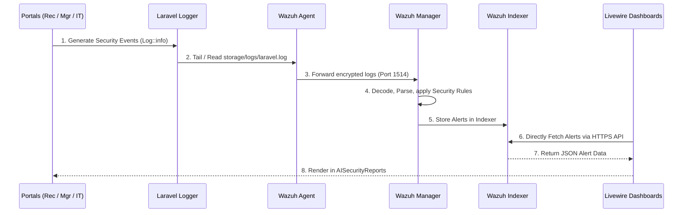

# Wazuh Security Architecture Integration

This document outlines the 5-step, end-to-end security pipeline integrating the Laravel application with the Wazuh SIEM stack. The goal of this architecture is to completely decouple threat detection and log processing from the application layer, delegating it entirely to dedicated, purpose-built Wazuh infrastructure.

## 1. Architecture Flow

The following Mermaid diagram illustrates the data flow from event generation in the Laravel portals to visualization in the management dashboards.



### Pipeline Breakdown
1. **Event Generation**: Forms, logins, and API actions across all three portals emit standard Laravel `Log::*` entries using the lightweight `SecurityMonitoringService.php`.
2. **Log Ingestion**: A Wazuh Agent, installed on the application server or running as a sidecar container, continuously monitors `storage/logs/laravel.log`.
3. **Agent Forwarding**: Raw log strings are pushed securely to the centralized Wazuh Manager.
4. **Rule Processing**: The Wazuh Manager processes logs using decoders and custom rules to classify severity and detect patterns (e.g., brute force attempts, SQL injection).
5. **Data Indexing**: If a rule threshold is met (typically Level 3+), an Alert is generated and pushed to the Wazuh Indexer (Elasticsearch/OpenSearch).
6. **Dashboard Fetching**: When a Manager or IT Officer opens the AI Security Reports dashboard, `AISecurityReports.php` securely queries the Wazuh Indexer API directly to render the data in real-time.

## 2. Portal-Specific Monitoring

While all portals write to the same log pipeline, their interactions differ slightly:

- **Receptionist Portal**: 
  - Strictly a source of logs. Forms filled by the receptionist (guestbooks, package tracking) and daily authentication events are monitored. Receptionists do not have access to view security dashboards.
- **Manager Portal**:
  - Acts as both a log source (approvals, workflow actions) and a log viewer. The Manager dashboard (`manager.ai-security`) surfaces high-level security reports retrieved from the Wazuh Indexer.
- **IT Officer Portal**:
  - Acts as a log source (system configuration changes, user management) and a log viewer. The IT Officer dashboard (`it-officer.ai-security`) shares the same codebase as the Manager view to monitor system health and security events.

## 3. Deprecated Legacy Components

As part of the strict 5-step Wazuh compliance refactor, local database storage of security events was eliminated. The following components were deleted:

- **`WazuhAlert` (MySQL Model)**: 
  - Alerts are no longer duplicated in the local `krbs-cap` database.
- **`WazuhAlertService`**:
  - Replaced entirely by direct API interactions inside the `AISecurityReports` component.
- **`WazuhSecurityMonitor` (Middleware)**:
  - Removed from `bootstrap/app.php`. Request monitoring is now handled implicitly by Laravel's built-in logging and the generic `SecurityMonitoringService`.
- **`SecurityMonitorController`**:
  - Decoupled and deleted. Webhooks pushed from the Manager to the application are no longer utilized; the application relies on an active pull (fetch) mechanism from the Indexer API instead.

## 4. Configuration and Environment Setup

To ensure `AISecurityReports.php` can successfully retrieve and parse alerts, the following variables must be configured in the `.env` file:

```env
# Required credentials for the Livewire dashboards to query the Indexer API.
# Note: DO NOT use default admin/SecretPassword in production.
WAZUH_INDEXER_INTERNAL_IP=10.0.0.50
WAZUH_INDEXER_USER=admin
WAZUH_INDEXER_PASSWORD=SecretPassword

# Fallbacks automatically supported:
# WAZUH_API_USER=admin
# WAZUH_API_PASS=SecretPassword
```

### API Integration Details (`AISecurityReports.php`)

- **Endpoint**: `https://{WAZUH_INDEXER_INTERNAL_IP}:9200/wazuh-alerts-*/_search`
- **Authentication**: Basic Auth mapping to the configured `.env` credentials.
- **Transport**: Disables SSL verification (`withoutVerifying()`) to support self-signed internal certificates generated by standard Wazuh deployments.
- **Error Handling**: Implements a strict `try-catch` timeout wrapper to ensure the dashboard fails gracefully (displaying an empty array and 'Unavailable' status) rather than crashing the portal if the Indexer goes offline.
- **Query Structure**: Implements a standard Elasticsearch boolean query (`bool.must.range`) to dynamically filter the output by `rule.level` based on UI selections.
